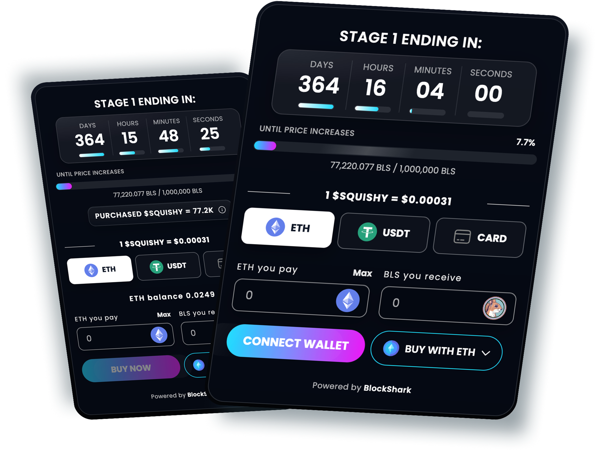

# Multi-Chain Presale Widget

A fully audited, embeddable **ICO / token presale script** that allows blockchain startups, developers, and entrepreneurs to deploy secure, multi-chain token presale platforms in minutes.  

This repository introduces [PresaleWidget](https://presalewidget.com), a professional-grade **presale widget** built for real-world token launches.

---

## 🌟 Key Features

- **Multi-chain support**: 17+ blockchains (Ethereum, Solana, BNB Chain, Polygon, Tron, Avalanche, Fantom, Arbitrum, Optimism, Base, Cardano, Gnosis, and more).  
- **Non-custodial architecture**: Funds never touch third-party wallets — projects maintain full control.  
- **Audited smart contracts**: Security-first approach with proven contract templates.  
- **Customizable presales**: Define soft/hard caps, vesting, and pricing models.  
- **Real-time investor dashboards**: Live contribution tracking and claim management.  
- **Referral system**: Built-in rewards with anti-sybil protections.  
- **Plug & play**: Embed in any website in seconds.  
- **Developer-friendly**: Full documentation, API hooks, and webhook support.  

---

## 📊 Performance Metrics

| Metric                      | Value                  |
|-----------------------------|------------------------|
| Average Widget Load Time    | **420ms**              |
| Uptime                      | **99.98%**             |
| Transaction Failure Rate    | **0.42%**              |
| Total Processed Transactions| **1.8M+**              |
| Supported Blockchains       | **17+**                |
| Integration Time            | **< 10 minutes**       |

---

## 🛠️ Tech Stack

- **Smart Contracts**: Solidity (EVM), Rust (Solana), Vyper (select modules)  
- **Frontend**: TypeScript, React, TailwindCSS  
- **Backend**: Node.js, Express, PostgreSQL  
- **Infrastructure**: Docker, Kubernetes, AWS  
- **Security**: OpenZeppelin libraries, Chainlink Oracles  
- **Wallets Supported**: MetaMask, Phantom, TronLink, WalletConnect  

---

## 💡 Why PresaleWidget?

| PresaleWidget                        | Custom Development              |
|--------------------------------------|---------------------------------|
| One-time license from **$599**       | $10,000+ average agency fees    |
| Launch in **minutes**                | Weeks to months                 |
| Audited, secure contracts            | Need separate audit ($5k–$20k)  |
| Works on 17+ chains out of the box   | Chain support = extra dev time  |
| Built-in referrals & dashboards      | Requires custom coding          |

---

## 🔒 Security

- **Non-custodial** — project teams always control their funds.  
- **Audited contracts** — built on OpenZeppelin standards.  
- **Tamper-proof pricing** — via Chainlink Oracles.  
- **Anti-sybil protections** — integrated into referral logic.  

---

## 📌 Roadmap

- ✅ Multi-chain support (17+ chains)  
- ✅ Referral and rewards system  
- ✅ Investor dashboard with live tracking  
- 🚧 Layer-2 integrations (zkSync, StarkNet)  
- 🚧 Advanced analytics dashboards  
- 🚧 AI-assisted presale configuration  

---

## 🤝 Contributing

We welcome community contributions!  
- Open an issue for feature requests  
- Submit PRs for bug fixes or improvements  
- Join our discussion channels for collaboration  

---

## 📬 Contact

- 🌐 Website: [https://presalewidget.com](https://presalewidget.com)  
- ✉️ Email: [info@blockshark.com](mailto:info@blockshark.com)  
- 💬 Telegram: [t.me/blocksharkcom](https://t.me/blocksharkcom)  

---

## ⚠️ Disclaimer

PresaleWidget is a **software tool** for presale deployment.  
It does not conduct token sales, handle funds, or provide investment services.  
Any use of PresaleWidget for token offerings is solely the responsibility of the project team.  
This repository is for **development and educational purposes only**.  

---
